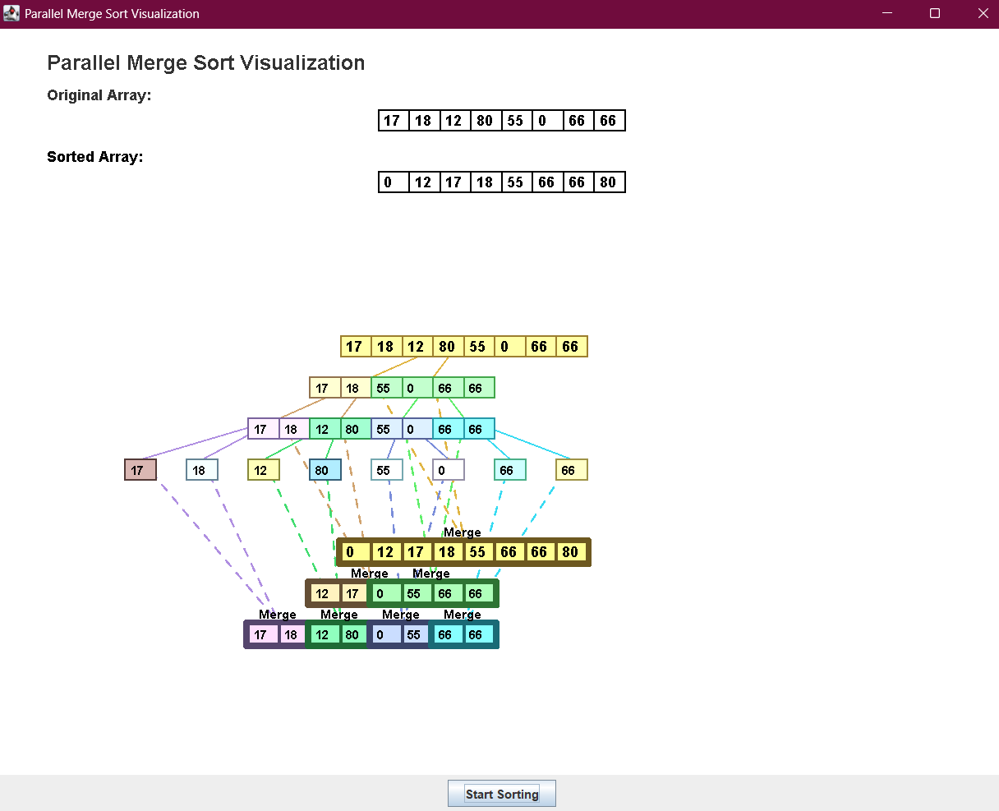
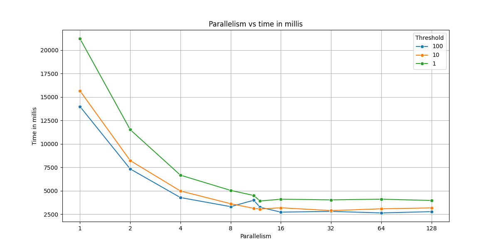
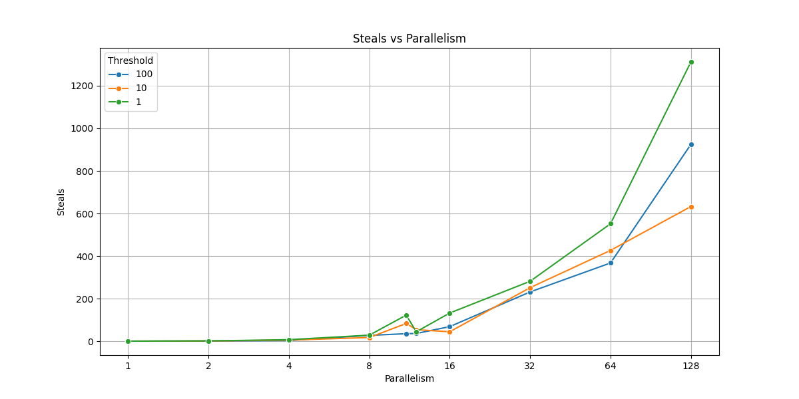
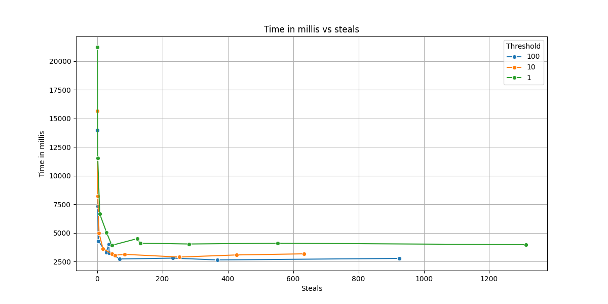
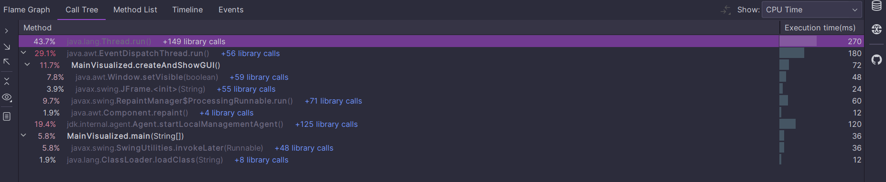
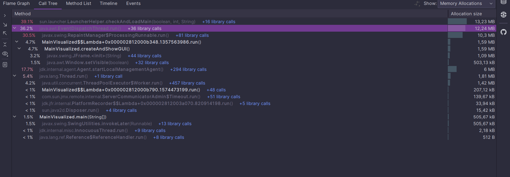
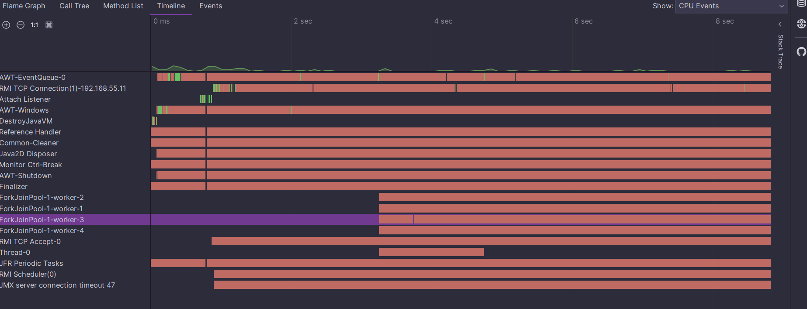

#  :computer: Prosta Symulacja Sortowania Przez Scalanie

## 🎯 Cel Projektu

Celem projektu było stworzenie aplikacji w języku **Java**, która demonstruje działanie **wielowątkowości** przy użyciu frameworka **Fork-Join**.

**Kluczowe założenia:**
- Nadpisanie metody `protected <T> compute()`
- Utworzenie obiektu klasy `ForkJoinPool` i uzupełnienie pozostałych komponentów całej aplikacji.

## Wykonana aplikacja
Wykonano aplikację w dwóch wersjach - konsolowej oraz wizualizowanej z pomocą frameworka `JFrame`.

Wynik działania programu aplikacji wizualizowanej:

Wynik działania programu aplikacji konsolowej:

| Threshold | L. wątków roboczych | L. kradzieży zadań | Czas (ms) |
|-----------|---------------------|--------------------|-----------|
| 1         | 11                  | 55                 | 4587      |
| 1         | 12                  | 39                 | 4310      |
| 1         | 1                   | 1                  | 20336     |
| 1         | 2                   | 2                  | 12629     |
| 1         | 4                   | 5                  | 7148      |
| 1         | 8                   | 18                 | 4757      |
| 1         | 16                  | 80                 | 3926      |
| 1         | 32                  | 202                | 3630      |
| 1         | 64                  | 773                | 4262      |
| 1         | 128                 | 1487               | 4799      |

---

| Threshold | L. wątków roboczych | L. kradzieży zadań | Czas (ms) |
|-----------|---------------------|--------------------|-----------|
| 10        | 11                  | 148                | 3301      |
| 10        | 12                  | 45                 | 2784      |
| 10        | 1                   | 1                  | 12547     |
| 10        | 2                   | 2                  | 6673      |
| 10        | 4                   | 5                  | 4177      |
| 10        | 8                   | 18                 | 2910      |
| 10        | 16                  | 65                 | 2719      |
| 10        | 32                  | 177                | 2717      |
| 10        | 64                  | 505                | 2846      |
| 10        | 128                 | 1013               | 2716      |

---

| Threshold | L. wątków roboczych | L. kradzieży zadań | Czas (ms) |
|-----------|---------------------|--------------------|-----------|
| 1         | 11                  | 174                | 3791      |
| 1         | 12                  | 78                 | 3891      |
| 1         | 1                   | 1                  | 18307     |
| 1         | 2                   | 2                  | 9997      |
| 1         | 4                   | 5                  | 6647      |
| 1         | 8                   | 29                 | 4792      |
| 1         | 16                  | 105                | 3697      |
| 1         | 32                  | 284                | 4218      |
| 1         | 64                  | 1213               | 4135      |
| 1         | 128                 | 1374               | 4032      |

## Profiler
- `CPU Time`:

- `Memory allocations`:

- `Timeline`:

